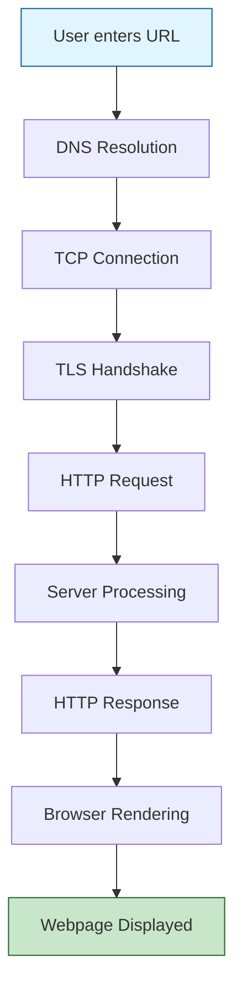

# how-the-internet-works

# How the Internet Works: URL to Webpage

## Overview: The Journey of a Web Request



## Detailed Technical Flow

### 1. DNS Resolution Process

When a user enters `https://example.com/page` in the browser:

```
┌─────────────────┐
│ Browser DNS     │ ─── Check local cache (TTL: 1-60 min) ──→ Found? ✓ Skip to TCP
│ Cache           │                                              ↓ Not found
└─────────────────┘
         ↓
┌─────────────────┐
│ OS DNS Cache    │ ─── System resolver cache check ────────→ Found? ✓ Skip to TCP
│ (hosts file)    │                                              ↓ Not found
└─────────────────┘
         ↓
┌─────────────────┐
│ Router Cache    │ ─── Local network cache check ──────────→ Found? ✓ Skip to TCP
│                 │                                              ↓ Not found
└─────────────────┘
         ↓
┌─────────────────┐     ┌──────────────────┐
│ ISP DNS Server  │────→│ Root Nameserver  │ ─── "Where is .com?" 
│ (Recursive)     │←────│ (13 globally)    │ ─── Returns .com TLD server
└─────────────────┘     └──────────────────┘
         ↓                       
┌─────────────────┐     ┌──────────────────┐
│ ISP DNS Server  │────→│ .com TLD Server  │ ─── "Where is example.com?"
│                 │←────│                  │ ─── Returns authoritative NS
└─────────────────┘     └──────────────────┘
         ↓
┌─────────────────┐     ┌──────────────────┐
│ ISP DNS Server  │────→│ Authoritative NS │ ─── "What's the A record?"
│                 │←────│ for example.com  │ ─── Returns IP: 93.184.216.34
└─────────────────┘     └──────────────────┘
```

**Modern DNS Security Options:**
- **DNS over HTTPS (DoH)**: Port 443, encrypted queries
- **DNS over TLS (DoT)**: Port 853, encrypted queries
- **DNSSEC**: Cryptographic validation of responses

### 2. TCP/IP Connection Establishment

**Three-Way Handshake Process:**

```
Client                                          Server
  │                                               │
  │──────── SYN (SEQ=1000) ─────────────────────→│ Port 443
  │         [SYN=1, ACK=0]                        │ (HTTPS)
  │         [Window=65535]                        │
  │         [MSS=1460]                            │
  │                                               │
  │←──────── SYN-ACK (SEQ=3000, ACK=1001) ───────│
  │         [SYN=1, ACK=1]                        │
  │         [Window=65535]                        │
  │         [MSS=1460]                            │
  │                                               │
  │──────── ACK (SEQ=1001, ACK=3001) ───────────→│
  │         [SYN=0, ACK=1]                        │
  │                                               │
  │         *** CONNECTION ESTABLISHED ***        │
```

**Key TCP Features:**
- **Sequence Numbers**: 32-bit for reliable delivery
- **Window Size**: Flow control mechanism
- **Keep-Alive**: Periodic packets to maintain connection
- **Connection States**: CLOSED → SYN-SENT → SYN-RECEIVED → ESTABLISHED

### 3. TLS 1.3 Handshake (Security Layer)

```
Client                                          Server
  │                                               │
  │───────── ClientHello ────────────────────────→│
  │  • Supported cipher suites                    │
  │  • Key share (ECDHE)                          │
  │  • Extensions                                 │
  │                                               │
  │←──────── ServerHello ─────────────────────────│
  │  • Selected cipher suite                      │
  │  • Key share                                  │
  │                                               │
  │←──────── {EncryptedExtensions} ───────────────│
  │←──────── {Certificate} ───────────────────────│
  │  • Server cert chain                          │
  │  • Intermediate CA cert                       │
  │  • Root CA reference                          │
  │                                               │
  │←──────── {CertificateVerify} ─────────────────│
  │  • Digital signature                          │
  │                                               │
  │←──────── {Finished} ──────────────────────────│
  │                                               │
  │───────── {Finished} ──────────────────────────→│
  │                                               │
  │      *** ENCRYPTED CONNECTION READY ***       │
```

**Certificate Verification Process:**
```
Root CA Certificate (Trusted)
    ↓ Signs
Intermediate CA Certificate  
    ↓ Signs
Server Certificate (example.com)
    ↓ Validates
Domain Name Match + Expiry Check + Revocation Check (OCSP)
```

### 4. HTTP Request Flow

**HTTP/1.1 vs HTTP/2 vs HTTP/3 Comparison:**

| Feature | HTTP/1.1 | HTTP/2 | HTTP/3 |
|---------|----------|---------|---------|
| Transport | TCP | TCP | QUIC (UDP) |
| Multiplexing | No | Yes | Yes |
| Head-of-line blocking | Yes | TCP level | No |
| Server push | No | Yes | Yes |
| Header compression | No | HPACK | QPACK |
| Encryption | Optional | Required* | Mandatory |
| Connection setup | 2-3 RTT | 2-3 RTT | 0-1 RTT |

**Sample HTTP Request:**
```http
GET /page HTTP/2
Host: example.com
User-Agent: Mozilla/5.0 (Windows NT 10.0; Win64; x64)
Accept: text/html,application/xhtml+xml,application/xml;q=0.9,*/*;q=0.8
Accept-Language: en-US,en;q=0.5
Accept-Encoding: gzip, br
Connection: keep-alive
Cache-Control: max-age=0
```

### 5. Request Processing Flow

```
┌─────────────────┐     ┌─────────────────┐     ┌─────────────────┐
│   CDN Check     │────→│  Edge Server?   │─Yes→│ Serve Cached    │
│                 │     │                 │     │ Content         │
└─────────────────┘     └─────────────────┘     └─────────────────┘
         │                       │ No                     │
         │                       ↓                        │
         │              ┌─────────────────┐              │
         └─────────────→│  Origin Server  │←─────────────┘
                        └─────────────────┘
                                │
                    ┌───────────┴────────────┐
                    ↓                        ↓
            ┌──────────────┐        ┌──────────────┐
            │ Web Server   │        │ Load Balancer│
            │ (Nginx)      │        │              │
            └──────────────┘        └──────────────┘
                    │                        │
                    ↓                        ↓
            ┌──────────────┐        ┌──────────────┐
            │ App Server   │        │ App Server   │
            │ (Node.js)    │        │ (Node.js)    │
            └──────────────┘        └──────────────┘
                    │                        │
                    └───────────┬────────────┘
                                ↓
                        ┌──────────────┐
                        │   Database   │
                        │ (PostgreSQL) │
                        └──────────────┘
```

### 6. Caching Hierarchy

```
┌─────────────────────────────────────────────────────────┐
│                    Caching Layers                       │
├─────────────────────────────────────────────────────────┤
│ 1. Browser Cache (Private)                              │
│    • Memory cache: ~100MB                               │
│    • Disk cache: ~1GB                                   │
│    • Service Worker cache                               │
├─────────────────────────────────────────────────────────┤
│ 2. Proxy/Corporate Cache                                │
│    • Shared cache for organization                      │
├─────────────────────────────────────────────────────────┤
│ 3. CDN Edge Servers (Public)                            │
│    • Geographically distributed (330+ locations)        │
│    • Anycast routing for nearest server                 │
├─────────────────────────────────────────────────────────┤
│ 4. Origin Server                                        │
│    • Authoritative source                               │
└─────────────────────────────────────────────────────────┘
```

**Cache Headers Flow:**
```
Request with: If-None-Match: "abc123"
              If-Modified-Since: Wed, 21 Oct 2023 07:28:00 GMT
                           ↓
Server checks: Has content changed?
                           ↓
        No ────────────────┼──────────────── Yes
        ↓                                      ↓
Return: 304 Not Modified              Return: 200 OK
        (No body)                     Cache-Control: max-age=3600
                                      ETag: "xyz789"
                                      [Full response body]
```

### 7. HTTP Response Transmission

```
HTTP/2 200 OK
Content-Type: text/html; charset=UTF-8
Content-Encoding: gzip
Cache-Control: public, max-age=3600
ETag: "3bf2-5c3a9b3a73680"
Vary: Accept-Encoding
Content-Security-Policy: default-src 'self'
X-Frame-Options: SAMEORIGIN

[Compressed HTML body - typically 60-80% smaller]
```

**Progressive Loading Strategy:**
```
┌─────────────────┐
│ Initial HTML    │ ──→ DOM parsing begins
└─────────────────┘
         ↓
┌─────────────────┐
│ Critical CSS    │ ──→ CSSOM construction
└─────────────────┘
         ↓
┌─────────────────┐
│ Above-fold      │ ──→ First Paint
│ content         │
└─────────────────┘
         ↓
┌─────────────────┐
│ JavaScript      │ ──→ Interactive
└─────────────────┘
         ↓
┌─────────────────┐
│ Images/Assets   │ ──→ Fully loaded
└─────────────────┘
```

### 8. Browser Rendering Pipeline

```
HTML ──────→ ┌──────────────┐      CSS ───────→ ┌──────────────┐
             │ HTML Parser  │                    │ CSS Parser   │
             └──────────────┘                    └──────────────┘
                    ↓                                    ↓
             ┌──────────────┐                    ┌──────────────┐
             │     DOM      │                    │    CSSOM     │
             └──────────────┘                    └──────────────┘
                    ↓                                    ↓
                    └────────────────┬───────────────────┘
                                     ↓
                              ┌──────────────┐
                              │ Render Tree  │
                              └──────────────┘
                                     ↓
                              ┌──────────────┐
                              │    Layout    │ ← Reflow
                              │  (Geometry)  │
                              └──────────────┘
                                     ↓
                              ┌──────────────┐
                              │    Paint     │ ← Repaint
                              │  (Pixels)    │
                              └──────────────┘
                                     ↓
                              ┌──────────────┐
                              │  Composite   │ ← GPU accelerated
                              │   Layers     │
                              └──────────────┘
                                     ↓
                              ┌──────────────┐
                              │   Display    │
                              └──────────────┘
```

**JavaScript Event Loop Integration:**
```
┌───────────────┐     ┌───────────────┐     ┌───────────────┐
│   Call Stack  │────→│ Web APIs      │────→│ Callback Queue│
│               │     │ (setTimeout,  │     │               │
│               │     │  fetch, etc)  │     │               │
└───────────────┘     └───────────────┘     └───────────────┘
        ↑                                            │
        └────────────── Event Loop ←─────────────────┘
```

### 9. Performance Timeline

```
Time →
0ms    ├─ DNS Lookup (10-100ms)
       │  └─ Cached: <1ms
       │
100ms  ├─ TCP Connection (1 RTT ~50ms)
       │
150ms  ├─ TLS Handshake (1-2 RTT ~50-100ms)
       │  └─ Session resumption: 0 RTT
       │
250ms  ├─ HTTP Request
       │
300ms  ├─ Server Processing (50-200ms)
       │  └─ CDN cache hit: <10ms
       │
400ms  ├─ First Byte (TTFB)
       │
500ms  ├─ HTML Download & Parse
       │
600ms  ├─ CSS/JS Download (parallel)
       │
700ms  ├─ First Paint (FP)
       │
800ms  ├─ First Contentful Paint (FCP)
       │
1000ms ├─ Largest Contentful Paint (LCP)
       │
1200ms ├─ Time to Interactive (TTI)
       │
∞      └─ Fully Loaded
```

### 10. Modern Optimizations

**Resource Hints:**
```html
<!-- DNS Prefetch - Resolve DNS early -->
<link rel="dns-prefetch" href="//api.example.com">

<!-- Preconnect - Establish connection early -->
<link rel="preconnect" href="https://fonts.googleapis.com">

<!-- Prefetch - Load resource for future navigation -->
<link rel="prefetch" href="/next-page.html">

<!-- Preload - High priority resource for current page -->
<link rel="preload" href="/critical.css" as="style">
```

**Connection Management:**
- **HTTP/1.1**: 6 parallel connections per domain
- **HTTP/2**: Single multiplexed connection
- **HTTP/3**: 0-RTT connection resumption
- **Connection pooling**: Reuse established connections

## Summary Flow Diagram

```
User enters: https://example.com/page
                    │
                    ↓
         ┌─────────────────────┐
         │   DNS Resolution     │ 10-100ms
         │ (Recursive queries)  │ 
         └─────────────────────┘
                    │
                    ↓
         ┌─────────────────────┐
         │  TCP Handshake      │ 1 RTT
         │  (SYN/SYN-ACK/ACK)  │ ~50ms
         └─────────────────────┘
                    │
                    ↓
         ┌─────────────────────┐
         │   TLS Handshake     │ 1-2 RTT
         │  (Certificate/Keys)  │ ~100ms
         └─────────────────────┘
                    │
                    ↓
         ┌─────────────────────┐
         │   HTTP Request      │
         │  (GET /page HTTP/2)  │
         └─────────────────────┘
                    │
    ┌───────────────┴───────────────┐
    ↓                               ↓
┌────────────┐             ┌─────────────────┐
│ CDN Cache  │             │ Origin Server   │
│  (Cache)   │             │  (Process)      │
└────────────┘             └─────────────────┘
    ↓                               ↓
    └───────────────┬───────────────┘
                    ↓
         ┌─────────────────────┐
         │   HTTP Response     │ 200 OK
         │  (Headers + Body)   │ + HTML
         └─────────────────────┘
                    │
                    ↓
         ┌─────────────────────┐
         │  Browser Rendering  │ Parse → Layout
         │     Pipeline        │ → Paint → Display
         └─────────────────────┘
                    │
                    ↓
            Webpage Displayed!
```

This comprehensive diagram illustrates the complete journey of a web request, from the moment a user enters a URL to the final rendered webpage, including all major protocols, caching mechanisms, security layers, and optimization techniques used in modern web architecture.
